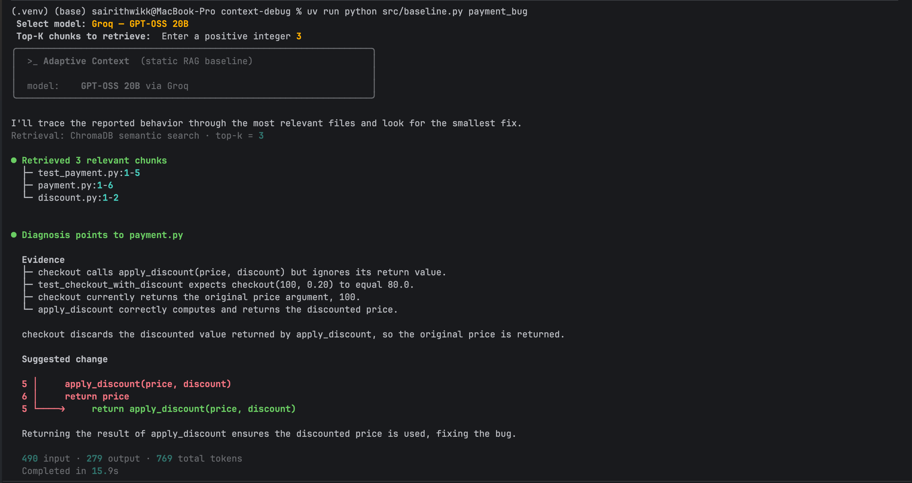

# Adaptive Context

**An AI debugging system that finds the right code context without overwhelming
the model.**



Adaptive Context explores how targeted retrieval, compression, and sequencing can
help an LLM explain a behavioral bug without receiving an entire repository. It is
designed for developers who can describe or reproduce a failure but do not yet know
which code is responsible.

### Core problem: context retrieval, compression, and sequencing

The system must determine which repository evidence is needed, remove unnecessary
context, and organize the remaining evidence so an LLM can trace a failure to the
responsible implementation:

- **Context retrieval:** find the source files, tests, functions, and dependencies
  relevant to the failure.
- **Context compression:** keep useful evidence and remove redundant code without
  losing information needed for diagnosis.
- **Context sequencing:** arrange retained evidence so the model can follow the
  path from the observed behavior to the likely faulty implementation.

This repository currently implements the **Static RAG baseline** for the CSE 598
capstone proposal. It performs one ChromaDB similarity search using the original
bug report, selects a fixed Top-K, and sends those chunks to one LLM for diagnosis.
It does not yet compress, prune, reorder, or adaptively retrieve context.

The future **Adaptive Context system** will add dynamic retrieval, context
compression, sequencing, and token-budget management. The current baseline is the
runnable comparison point for that work.

## Quickstart

### 1. Install the project

Requirements:

- Python 3.12 or newer
- [uv](https://docs.astral.sh/uv/)
- Internet access for the first embedding-model download and Groq inference
- A Groq API key for the recommended baseline run

Clone the repository and install the locked dependencies:

```bash
git clone https://github.com/YB-Yottabyte/cse598-capstone-project-proposal.git
cd cse598-capstone-project-proposal
uv sync --dev
```

### 2. Configure Groq and GPT-OSS 20B

Create an API key in the [GroqCloud Console](https://console.groq.com/keys). In the
repository root, create a `.env` file containing:

> **Important: Do not forget to create the `.env` file and add your Groq API key
> before running the Groq baseline.**

```dotenv
GROQ_API_KEY=gsk_your_key_here
GROQ_MODEL=openai/gpt-oss-20b
```

Load the variables into the current terminal session:

```bash
set -a
source .env
set +a
```

The CLI does not load `.env` automatically. Confirm that the key is available
without printing it:

```bash
test -n "$GROQ_API_KEY" && echo "GROQ_API_KEY is set"
```

The `.env` file is ignored by Git and must not be committed. The exact Groq model
ID used by the baseline is `openai/gpt-oss-20b`. See the
[Groq API quickstart](https://console.groq.com/docs/quickstart) and
[GPT-OSS 20B model page](https://console.groq.com/docs/model/openai/gpt-oss-20b)
for provider details.

### 3. Optional local MLX provider

Local inference is available only on an Apple Silicon Mac. Linux, Windows, and
Intel Mac users should use Groq. Confirm the machine architecture:

```bash
uname -m
```

The result must be `arm64`. The default public model is
[`mlx-community/Qwen2.5-Coder-1.5B-Instruct-4bit`](https://huggingface.co/mlx-community/Qwen2.5-Coder-1.5B-Instruct-4bit),
which normally does not require a Hugging Face account or token. Run it with:

```bash
uv run python src/baseline.py payment_bug \
    --provider local \
    --model mlx-community/Qwen2.5-Coder-1.5B-Instruct-4bit \
    --top-k 3
```

On the first run, MLX downloads and caches the model files. Other compatible local
models can be found in the
[MLX Community collection](https://huggingface.co/mlx-community) and selected with
`--model OWNER/MODEL_REPOSITORY` or this optional `.env` setting:

```dotenv
CONTEXT_DEBUG_MODEL=OWNER/MODEL_REPOSITORY
```

### 4. Confirm the intentional `payment_bug` failure

Run the test case independently:

```bash
uv run pytest test_cases/payment_bug
```

This command is **expected to fail** because the test case is intentionally buggy.
A failure such as `assert 100 == 80.0` confirms that the evaluation case is working
as intended.

### 5. Run the AI debugging baseline

For a reproducible Groq run:

```bash
uv run python src/baseline.py payment_bug \
    --provider groq \
    --model openai/gpt-oss-20b \
    --top-k 3
```

For an interactive run:

```bash
uv run python src/baseline.py payment_bug
```

When `--provider` is omitted, the CLI automatically uses Groq if it is the only
available provider. If both Groq and local MLX are available, it displays the model
selection menu shown in the screenshot. When `--top-k` is omitted, the CLI asks for
a positive integer. For `payment_bug`, enter `3` to retrieve the test, checkout
implementation, and discount helper.

The short name `payment_bug` resolves to `test_cases/payment_bug`. An explicit path
also works:

```bash
uv run python src/baseline.py test_cases/payment_bug \
    --provider groq \
    --top-k 3
```

Input is read from the selected directory. Results are printed directly to the
terminal; the baseline does not modify the test case or create an output file. The
first semantic-retrieval run downloads ChromaDB's embedding model and may take
longer. Local Chroma data is stored in the ignored `.chroma/` directory.

### 6. Run the baseline's own tests

```bash
uv run pytest
uv run ruff check .
```

Root-level pytest runs only the tests under `tests/`. The intentionally failing
evaluation cases under `test_cases/` are excluded from normal test collection.

## Input and Output

Each evaluation input is a self-contained directory under
`test_cases/<case_name>/` containing:

- a non-empty `bug_report.txt` written from the developer's perspective;
- Python implementation files; and
- at least one pytest test exposing the intentional bug.

For example:

```text
test_cases/payment_bug/
├── bug_report.txt
├── discount.py
├── payment.py
└── test_payment.py
```

The baseline retrieves repository chunks and prints the retrieval method, selected
file locations, supporting evidence, root-cause diagnosis, relevant file,
suggested code change, token usage, and execution time. It currently writes no
separate result file.

## Test Cases

| Test case | Main bug category |
| --- | --- |
| `payment_bug` | Ignored return value / business logic |
| `auth_bug` | Incorrect conditional logic across files |
| `batching_bug` | Exact-boundary edge case |
| `config_bug` | Configuration and default interaction |
| `data_parsing_bug` | Quoted CSV parsing |
| `state_mutation_bug` | Unintended state mutation across files |

The examples below use `payment_bug`. Run it interactively without specifying a
provider or Top-K:

```bash
uv run python src/baseline.py payment_bug
```

If local MLX is unavailable and `GROQ_API_KEY` is loaded, the CLI selects Groq
automatically and asks for Top-K. If both providers are available, select Groq from
the menu and then enter `3`. A model that is merely absent from the local cache is
not considered unavailable; on supported Apple Silicon Macs, MLX downloads its
default model on first use.

The equivalent explicit command is:

```bash
uv run python src/baseline.py payment_bug --provider groq --top-k 3
```

## Example Baseline Output

The `payment_bug` input in `bug_report.txt` is:

```text
Customers with a 20% discount are being charged the original price.
checkout(100, 0.20) should return 80.0, but currently returns 100.
```

One observed Groq run with Top-K 3 produced:

```text
Retrieval: ChromaDB semantic search · top-k = 3

● Retrieved 3 relevant chunks
  ├─ test_payment.py:1-5
  ├─ payment.py:1-6
  └─ discount.py:1-2

● Diagnosis points to payment.py

  Evidence
  ├─ checkout calls apply_discount(price, discount) but ignores its return value.
  ├─ test_checkout_with_discount expects checkout(100, 0.20) to equal 80.0.
  ├─ checkout currently returns the original price argument, 100.
  └─ apply_discount correctly computes and returns the discounted price.

  checkout discards the discounted value returned by apply_discount, so the original price is returned.

  Suggested change

  5 │     apply_discount(price, discount)
  6 │     return price
  5 └────→     return apply_discount(price, discount)

  Returning the result of apply_discount ensures the discounted price is used, fixing the bug.

  490 input · 279 output · 769 total tokens
  Completed in 15.9s
```

This run succeeded because retrieval included the failing test, the faulty checkout
implementation, and the helper needed to support the diagnosis.

## Repository Structure

```text
.
├── src/
│   ├── baseline.py             # executable entry point
│   ├── cli.py                  # arguments and interactive configuration
│   ├── pipeline.py             # Static RAG workflow and timings
│   ├── retrieval.py            # repository chunking and retrieval interfaces
│   ├── semantic_retrieval.py   # ChromaDB similarity retrieval
│   ├── context_builder.py      # debugging prompt construction
│   ├── debugging_result.py     # response parsing and change analysis
│   ├── terminal_ui.py          # terminal presentation and response streaming
│   └── providers/
│       ├── base.py             # provider interface and result model
│       ├── factory.py          # provider discovery and construction
│       ├── groq_provider.py    # hosted Groq inference
│       └── local_mlx.py        # optional Apple Silicon inference
├── test_cases/                 # intentionally buggy evaluation repositories
│   ├── auth_bug/
│   ├── batching_bug/
│   ├── config_bug/
│   ├── data_parsing_bug/
│   ├── payment_bug/
│   └── state_mutation_bug/
├── tests/                      # baseline's passing unit tests
├── adaptive-context.png        # terminal output screenshot
├── pyproject.toml              # metadata, dependencies, and tool settings
├── uv.lock                     # locked dependency versions
└── README.md
```

## Current Baseline Limitations

- Retrieval happens once using the original bug report.
- Context selection uses a fixed Top-K.
- There is no adaptive retrieval.
- There is no context pruning, deduplication, compression, or adaptive sequencing.
- Suggested changes are advisory; the baseline does not apply patches or run
  verification tests.

These limitations make the Static RAG baseline a clear comparison point for the
future Adaptive Context system.

## Generative AI Use

Generative AI tools, including Codex, were used to assist with implementation and
documentation. Their use is disclosed for transparency. I reviewed, edited, and
tested all generated suggestions before including them in the project.
