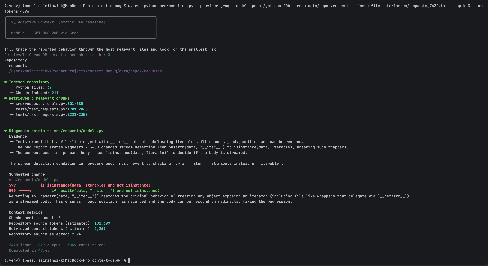

<h1 align="center">Adaptive Context</h1>

<p align="center">
  <strong>An AI debugging system that finds the right code context without overwhelming the model.</strong>
</p>

<p align="center">
  
</p>

Adaptive Context explores **how targeted retrieval, compression, and sequencing** can
help an LLM explain a behavioral bug without receiving an entire repository. It is
designed for developers who can describe or reproduce a failure but do not yet know
which code is responsible.

### Core problem: context retrieval, compression, and sequencing

The system must determine which repository evidence is needed, remove unnecessary
context, and organize the remaining evidence so an LLM can trace a failure to the
responsible implementation:

- **Context retrieval:** find the source files, tests, functions, and dependencies
  relevant to the failure.
- **Context compression:** keep useful evidence and remove redundant code without
  losing information needed for diagnosis.
- **Context sequencing:** arrange retained evidence so the model can follow the
  path from the observed behavior to the likely faulty implementation.

This repository currently implements the **Static RAG baseline** for the CSE 598
capstone proposal. It performs one ChromaDB similarity search using the original
bug report, selects a fixed Top-K, and sends those chunks to one LLM for diagnosis.
It does not yet compress, prune, reorder, or adaptively retrieve context.

The future **Adaptive Context system** will add dynamic retrieval, context
compression, sequencing, and token-budget management. The current baseline is the
runnable comparison point for that work.

## Quickstart

### 1. Install the project

Requirements:

- Python 3.12 or newer
- [uv](https://docs.astral.sh/uv/)
- Internet access for the first embedding-model download and Groq inference
- A Groq API key for the recommended baseline run

Clone the repository and install the locked dependencies:

```bash
git clone https://github.com/YB-Yottabyte/cse598-capstone-project-proposal.git
cd cse598-capstone-project-proposal
uv sync --dev
```

### 2. Configure Groq and GPT-OSS 20B

Create an API key in the [GroqCloud Console](https://console.groq.com/keys). On
**macOS or Linux**, create a `.env` file in the repository root containing:

> **Important: Configure `GROQ_API_KEY` before running the Groq baseline. Use the
> `.env` instructions for Bash/Zsh or the session commands below on Windows.**

```dotenv
GROQ_API_KEY=gsk_your_key_here
GROQ_MODEL=openai/gpt-oss-20b
```

On **macOS or Linux**, load the variables into the current Bash/Zsh session:

```bash
set -a
source .env
set +a
```

**Windows PowerShell** does not use `source`. Set the same variables for the current
PowerShell session, then run the baseline:

```powershell
$env:GROQ_API_KEY = "gsk_your_key_here"
$env:GROQ_MODEL = "openai/gpt-oss-20b"

uv run python src/baseline.py payment_bug --provider groq --top-k 3
```

To confirm the key is set in PowerShell without displaying it:

```powershell
if ($env:GROQ_API_KEY) { Write-Output "GROQ_API_KEY is set" }
```

For Windows Command Prompt (`cmd.exe`), use:

```bat
set "GROQ_API_KEY=gsk_your_key_here"
set "GROQ_MODEL=openai/gpt-oss-20b"

uv run python src/baseline.py payment_bug --provider groq --top-k 3
```

These PowerShell and Command Prompt variables last only for the current terminal
session. Open a new terminal and set them again when needed.

The CLI does not load `.env` automatically. Confirm that the key is available
without printing it on Bash/Zsh:

```bash
test -n "$GROQ_API_KEY" && echo "GROQ_API_KEY is set"
```

The `.env` file is ignored by Git and must not be committed. The exact Groq model
ID used by the baseline is `openai/gpt-oss-20b`. See the
[Groq API quickstart](https://console.groq.com/docs/quickstart) and
[GPT-OSS 20B model page](https://console.groq.com/docs/model/openai/gpt-oss-20b)
for provider details.

### 3. Optional local MLX provider

Local inference is available only on an Apple Silicon Mac. Linux, Windows, and
Intel Mac users should use Groq. Confirm the machine architecture:

```bash
uname -m
```

The result must be `arm64`. The default public model is
[`mlx-community/Qwen2.5-Coder-1.5B-Instruct-4bit`](https://huggingface.co/mlx-community/Qwen2.5-Coder-1.5B-Instruct-4bit),
which normally does not require a Hugging Face account or token. Run it with:

```bash
uv run python src/baseline.py payment_bug \
    --provider local \
    --model mlx-community/Qwen2.5-Coder-1.5B-Instruct-4bit \
    --top-k 3
```

On the first run, MLX downloads and caches the model files. Other compatible local
models can be found in the
[MLX Community collection](https://huggingface.co/mlx-community) and selected with
`--model OWNER/MODEL_REPOSITORY` or this optional `.env` setting:

```dotenv
CONTEXT_DEBUG_MODEL=OWNER/MODEL_REPOSITORY
```

### 4. Confirm the intentional `payment_bug` failure

Run the test case independently:

```bash
uv run pytest test_cases/payment_bug
```

This command is **expected to fail** because the test case is intentionally buggy.
A failure such as `assert 100 == 80.0` confirms that the evaluation case is working
as intended.

### 5. Run the AI debugging baseline

For a reproducible Groq run:

```bash
uv run python src/baseline.py payment_bug \
    --provider groq \
    --model openai/gpt-oss-20b \
    --top-k 3
```

For an interactive run:

```bash
uv run python src/baseline.py payment_bug
```

When `--provider` is omitted, the CLI automatically uses Groq if it is the only
available provider. If both Groq and local MLX are available, it displays the model
selection menu shown in the screenshot. When `--top-k` is omitted, the CLI asks for
a positive integer. For `payment_bug`, enter `3` to retrieve the test, checkout
implementation, and discount helper.

The short name `payment_bug` resolves to `test_cases/payment_bug`. An explicit path
also works:

```bash
uv run python src/baseline.py test_cases/payment_bug \
    --provider groq \
    --top-k 3
```

Input is read from the selected directory. Results are printed directly to the
terminal; the baseline does not modify the test case or create an output file. The
first semantic-retrieval run downloads ChromaDB's embedding model and may take
longer. Local Chroma data is stored in the ignored `.chroma/` directory.

### 6. Run against a local real repository

See [Real-World Repository Evaluation](#real-world-repository-evaluation) for the
optional Requests #7432 walkthrough. It documents the procedure only; it does not
record or imply a benchmark result.

### 7. Run the baseline's own tests

```bash
uv run pytest
uv run ruff check .
```

Root-level pytest runs only the tests under `tests/`. The intentionally failing
evaluation cases under `test_cases/` are excluded from normal test collection.

## Input and Output

Both input workflows feed the same repository chunking, Chroma retrieval, prompt,
and one-model-call pipeline.

### Controlled-case input

Each controlled input is a self-contained directory under
`test_cases/<case_name>/` containing:

- a non-empty `bug_report.txt` written from the developer's perspective;
- Python implementation files; and
- at least one pytest test exposing the intentional bug.

For example:

```text
test_cases/payment_bug/
├── bug_report.txt
├── discount.py
├── payment.py
└── test_payment.py
```

The baseline retrieves repository chunks and prints the retrieval method, selected
file locations, supporting evidence, root-cause diagnosis, relevant file,
suggested code change, token usage, and execution time. It currently writes no
separate result file.

The positional command remains the shortest controlled-case form:

```bash
uv run python src/baseline.py payment_bug --provider groq --top-k 3
```

The explicit form is also supported. The legacy `examples/` prefix maps to the
current `test_cases/` directory for command compatibility:

```bash
uv run python src/baseline.py \
    --provider groq \
    --example examples/payment_bug \
    --top-k 3
```

## Evaluation Workflow

The project evaluates the same Static RAG baseline in two stages. The stages vary
the input difficulty, not the retrieval architecture or model-call workflow.

### Controlled Development Cases

The two cases under `test_cases/` are intentionally small, controlled debugging
examples. They are development and sanity cases used to:

- verify retrieval behavior;
- validate the end-to-end pipeline;
- test terminal output;
- measure basic token usage; and
- make regressions easy to diagnose.

They exercise known failure categories, but they are not real-world benchmark
data and should not be presented as such.

| Test case | Evaluation role |
| --- | --- |
| `payment_bug` | Simple controlled sanity case for an ignored return value |
| `auth_bug` | Slightly more complex controlled multi-file authorization case |

These lead into Requests #7432 as the medium real-world repository evaluation.

The examples below use `payment_bug`. Run it interactively without specifying a
provider or Top-K:

```bash
uv run python src/baseline.py payment_bug
```

If local MLX is unavailable and `GROQ_API_KEY` is loaded, the CLI selects Groq
automatically and asks for Top-K. If both providers are available, select Groq from
the menu and then enter `3`. A model that is merely absent from the local cache is
not considered unavailable; on supported Apple Silicon Macs, MLX downloads its
default model on first use.

The equivalent explicit command is:

```bash
uv run python src/baseline.py payment_bug --provider groq --top-k 3
```

### Real-World Repository Evaluation

The controlled `payment_bug` and `auth_bug` cases remain the development and sanity
checks. As an optional medium-difficulty real-world evaluation, the same Static RAG
baseline can run against a historical bug from
[`psf/requests`](https://github.com/psf/requests).

<details>
<summary><strong>Optional: Test with Requests #7432</strong></summary>

[Requests issue #7432](https://github.com/psf/requests/issues/7432) is a real
regression affecting `PreparedRequest.prepare_body` in Requests 2.34.0. For this
baseline case, Requests is checked out at the historical buggy 2.34.0 release
revision, while a concise issue report is stored separately. The known maintainer
fix must **not** be included in the repository context or issue text supplied to
the LLM. This remains one fixed Top-K retrieval followed by one LLM call.

```text
Real bug report
    ↓
Historical buggy repository revision
    ↓
Repository chunking/indexing
    ↓
One fixed Top-K retrieval
    ↓
One LLM call
    ↓
Diagnosis + suggested change
    ↓
Evaluation against known maintainer fix
```

##### 1. Create the local directories

```bash
mkdir -p data/repos data/issues
```

##### 2. Clone Requests locally

```bash
git clone -c fetch.fsck.badTimezone=ignore \
  https://github.com/psf/requests.git \
  data/repos/requests
```

The `data/repos/` directory is ignored by Git. The third-party Requests checkout
at `data/repos/requests` is local only and must not be committed or pushed to this
capstone repository.

##### 3. Check out and verify the historical buggy revision

Check out the Requests 2.34.0 release commit:

```bash
git -C data/repos/requests checkout 0b401c7
```

Verify the checkout:

```bash
git -C data/repos/requests rev-parse --short HEAD
```

Expected output:

```text
0b401c76
```

##### 4. Create the issue input

Create the separate issue file:

```bash
touch data/issues/requests_7432.txt
```

Open that file and paste this concise reproduction description:

```text
PreparedRequest.prepare_body stream detection regression

Requests 2.34.0 changed stream detection in PreparedRequest.prepare_body()
from checking for __iter__ to using isinstance(data, Iterable).

File-like wrappers that expose __iter__, read, tell, and seek through
__getattr__ delegation are no longer recognized correctly as streaming
request bodies.

As a result, the body position is not recorded and the body cannot be
rewound correctly during 307/308 redirects.

Expected behavior:
The upload should continue successfully through the redirect.

Actual behavior:
The redirected request may send an already-consumed or empty body and
eventually time out.
```

This is a concise evaluation input based on the real issue. It describes the
regression without including the known maintainer solution.

##### 5. Run the Static RAG baseline

```bash
uv run python src/baseline.py \
  --provider groq \
  --model openai/gpt-oss-20b \
  --repo data/repos/requests \
  --issue-file data/issues/requests_7432.txt \
  --top-k 3 \
  --max-tokens 4096
```

Inspect the result for:

- the retrieved source files and chunks;
- whether `src/requests/models.py` was retrieved;
- the diagnosis;
- the suggested change;
- the amount and percentage of repository context selected;
- input, output, and total tokens; and
- latency.

Retrieving `src/requests/models.py` does not automatically make the diagnosis or
suggested change correct. Retrieval success, diagnosis accuracy, and
suggested-change correctness are evaluated separately.

Repository safety for this workflow:

- `data/repos/requests` is a local-only third-party checkout;
- `data/repos/` is Git-ignored;
- `.env` and `.chroma/` remain Git-ignored;
- the cloned Requests repository must not be committed or pushed; and
- small reproducible inputs under `data/issues/` may be committed if desired.

Optional JSON metadata can support post-retrieval evaluation:

```json
{
  "repo": "OWNER/REPOSITORY",
  "issue_number": "ISSUE_NUMBER",
  "base_commit": "BUGGY_COMMIT_SHA",
  "gold_patch_files": [
    "path/to/implementation.py",
    "tests/test_regression.py"
  ]
}
```

Pass it separately:

```bash
uv run python src/baseline.py \
    --provider groq \
    --model openai/gpt-oss-20b \
    --repo data/repos/requests \
    --issue-file data/issues/requests_<issue>.txt \
    --metadata data/issues/requests_<issue>_metadata.json \
    --top-k 3 \
    --max-tokens 4096
```

Metadata is used only after retrieval to compare selected paths with
`gold_patch_files`; it is never included in the LLM prompt. The metadata determines
which paths count as gold, so test files are not automatically treated as the
primary faulty implementation file.

#### Real-world evaluation criteria

Record these measures for a completed real-world run:

- whether the gold or relevant implementation file was retrieved;
- diagnosis accuracy;
- suggested-change correctness;
- retrieved context size;
- percentage of repository context selected;
- input, output, and total tokens; and
- latency.

Retrieval success and diagnosis correctness are separate outcomes. A run may
retrieve the correct file but still produce an incorrect diagnosis or patch. That
distinction is central to evaluating whether context selection alone is sufficient.

This remains the **Static RAG baseline**: one fixed Top-K retrieval followed by one
LLM call. Later, Adaptive Context / Dynamic RAG will be evaluated against the same
cases using the same repository revision, issue text, provider, model, and
evaluation criteria.

</details>

## Example Baseline Output

The `payment_bug` input in `bug_report.txt` is:

```text
Customers with a 20% discount are being charged the original price.
checkout(100, 0.20) should return 80.0, but currently returns 100.
```

One observed Groq run with Top-K 3 produced:

```text
Retrieval: ChromaDB semantic search · top-k = 3

● Retrieved 3 relevant chunks
  ├─ test_payment.py:1-5
  ├─ payment.py:1-6
  └─ discount.py:1-2

● Diagnosis points to payment.py

  Evidence
  ├─ checkout calls apply_discount(price, discount) but ignores its return value.
  ├─ test_checkout_with_discount expects checkout(100, 0.20) to equal 80.0.
  ├─ checkout currently returns the original price argument, 100.
  └─ apply_discount correctly computes and returns the discounted price.

  checkout discards the discounted value returned by apply_discount, so the original price is returned.

  Suggested change

  5 │     apply_discount(price, discount)
  6 │     return price
  5 └────→     return apply_discount(price, discount)

  Returning the result of apply_discount ensures the discounted price is used, fixing the bug.

  490 input · 279 output · 769 total tokens
  Completed in 15.9s
```

This run succeeded because retrieval included the failing test, the faulty checkout
implementation, and the helper needed to support the diagnosis.

## Repository Structure

```text
.
├── src/
│   ├── baseline.py             # executable entry point
│   ├── cli.py                  # arguments and interactive configuration
│   ├── pipeline.py             # Static RAG workflow and timings
│   ├── retrieval.py            # repository chunking and retrieval interfaces
│   ├── semantic_retrieval.py   # ChromaDB similarity retrieval
│   ├── debugging_case.py       # shared controlled/real input model
│   ├── context_metrics.py      # context estimates and retrieval evaluation
│   ├── context_builder.py      # debugging prompt construction
│   ├── debugging_result.py     # response parsing and change analysis
│   ├── terminal_ui.py          # terminal presentation and response streaming
│   └── providers/
│       ├── base.py             # provider interface and result model
│       ├── factory.py          # provider discovery and construction
│       ├── groq_provider.py    # hosted Groq inference
│       └── local_mlx.py        # optional Apple Silicon inference
├── test_cases/                 # intentionally buggy evaluation repositories
│   ├── auth_bug/
│   └── payment_bug/
├── tests/                      # baseline's passing unit tests
├── data/
│   ├── issues/                 # small reproducible real-world case inputs
│   └── repos/                  # ignored external repository checkouts
├── adaptive-context.png        # terminal output screenshot
├── pyproject.toml              # metadata, dependencies, and tool settings
├── uv.lock                     # locked dependency versions
└── README.md
```

## Current Baseline Limitations

- Retrieval happens once using the original bug report.
- Context selection uses a fixed Top-K.
- There is no adaptive retrieval.
- There is no context pruning, deduplication, compression, or adaptive sequencing.
- Suggested changes are advisory; the baseline does not apply patches or run
  verification tests.

These limitations make the Static RAG baseline a clear comparison point for the
future Adaptive Context system.

## Semester Scope

This capstone project focuses on developing and evaluating an **adaptive context-management system for LLM-based software debugging**. The system uses Dynamic RAG as part of the approach to improve how repository evidence is retrieved, compressed, sequenced, and managed before being sent to the model.

The planned work includes:

- **Dynamic retrieval:** retrieve additional repository evidence when the current context is not sufficient.
- **Query refinement:** use information discovered during analysis to guide later retrieval.
- **Context compression:** remove irrelevant or redundant code while preserving evidence needed for diagnosis.
- **Context sequencing:** organize retained evidence so the model can follow the path from the reported failure to the likely root cause.
- **Context prioritization:** rank evidence based on its relevance to the current debugging task.
- **Token-efficient context management:** reduce unnecessary input-token usage while preserving enough information for accurate diagnosis.
- **Grounded diagnosis:** identify the likely faulty behavior, relevant file, and suggested change using repository evidence.
- **Evaluation:** compare the adaptive system with the Static RAG baseline using retrieval quality, diagnosis accuracy, context size, token usage, latency, and reliability.

The project aims to analyze a repository and construct a smaller, more focused context while preserving the evidence needed to explain a failure. The goal is to improve debugging quality while reducing unnecessary context and token usage.

## Generative AI Use

Generative AI tools including Codex were used to assist with implementation and
documentation. Their use is disclosed for transparency. I reviewed, edited, and
tested all generated suggestions before including them in the project.
